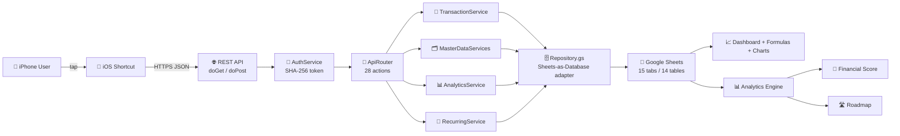
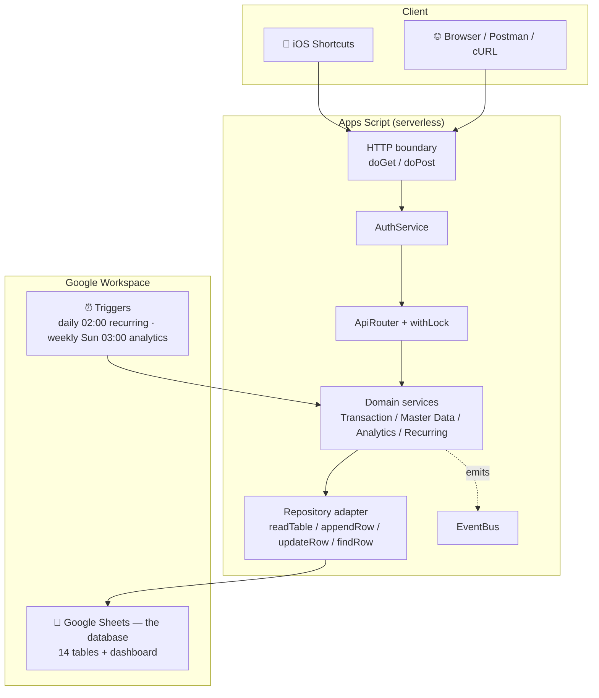
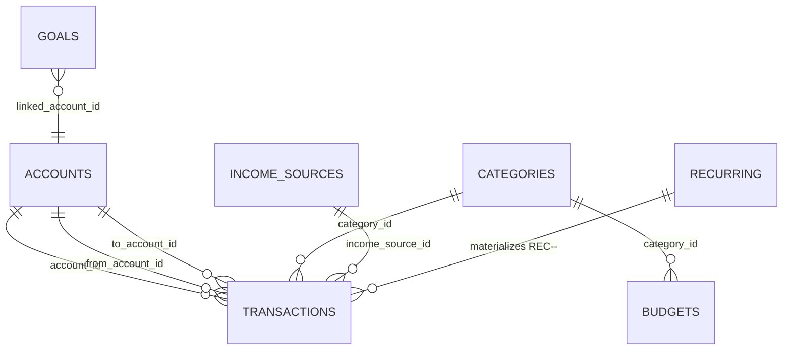

<div align="center">

# ✈️ FinPilot

**Your personal AI-powered Financial Operating System**

> Not an expense tracker. The data foundation of your financial life.

<br/>

| | | | |
|---|---|---|---|
|  |  |  |  |
|  | -F7DF1E) |  |  |

<br/>

<!-- BANNER: Add your FinPilot banner image here (e.g. /assets/banner.png) -->

<!-- LOGO: Add your logo here (e.g. /assets/logo.svg) -->

<!-- DEMO: Add your demo GIF here (e.g. /assets/demo.gif) -->

**Record an expense. Check your score. Watch your roadmap progress.** All from your iPhone, in seconds.

</div>

---

## 📖 Table of Contents

- [Introduction](#-introduction)
- [Features](#-features)
- [Architecture](#-architecture)
- [Folder Structure](#-folder-structure)
- [Database Schema](#-database-schema)
- [Business Rules](#-business-rules)
- [REST API](#-rest-api)
- [Installation](#-installation)
- [Complete Setup Guide](#-complete-setup-guide)
- [Deploy the REST API](#-deploy-the-rest-api)
- [Configure the API](#-configure-the-api)
- [Test the API](#-test-the-api)
- [iPhone Shortcut Integration](#-iphone-shortcut-integration)
- [Daily Usage](#-daily-usage)
- [Troubleshooting](#-troubleshooting)
- [Security](#-security)
- [Performance](#-performance)
- [Development](#-development)
- [Roadmap](#-roadmap)
- [FAQ](#-faq)
- [License](#-license)
- [Support](#-support)
- [Credits](#-credits)

---

## 💡 Introduction

### What is FinPilot?

FinPilot is a **self-hosted, database-first Financial Operating System** that runs on software you already own: **Google Sheets** as the database and **Google Apps Script** as the serverless REST backend.

It tracks income, expenses, transfers, accounts, budgets, goals and recurring bills — then goes far beyond tracking. It computes your **financial score**, builds a **7-stage financial roadmap**, analyzes spending, and produces a live dashboard of your net worth, burn rate, savings rate and more.

### Why does it exist?

Most money apps are closed black boxes: your data lives in someone else's database, export is a CSV afterthought, and "your numbers" are locked behind a subscription.

FinPilot exists because your **financial data should belong to you**. Every record lives in a spreadsheet you can open, edit, back up and export at any time. The entire backend is a few hundred lines of readable JavaScript. There is no server to pay for, no database to maintain, and no lock-in.

### Who is it for?

| Audience | Why FinPilot fits |
|---|---|
| **Individuals** | Track daily spending from your iPhone with a single tap. |
| **Frugal / debt-free enthusiasts** | The roadmap stages you through survival → debt freedom → financial freedom. |
| **Developers** | A clean REST API, a real relational schema, and a migration path to PostgreSQL. |
| **Tinkerers & data owners** | Your "database" is a spreadsheet — query it, script it, own it. |
| **Privacy-conscious users** | No cloud service besides Google, no data resale, no third-party analytics. |

### What problems does it solve?

- 💸 **Double-entry confusion** — one ledger, strict type rules, nothing hand-derived.
- 🔁 **Forgotten subscriptions & bills** — a recurring engine that materializes them, never double-booking.
- 📉 **"Where did my money go?"** — merchant & category analytics every month.
- 🎯 **No direction** — a financial score and a 7-stage roadmap that tell you *what to fix next*.
- 🧾 **Manual bookkeeping** — iPhone Shortcuts turn logging into a two-second action.
- 🔐 **Data hostage** — export anything to JSON/CSV; migrate to PostgreSQL with zero schema redesign.

### What makes it different from an expense tracker?

> An expense tracker answers: *"How much did I spend?"*
>
> FinPilot answers: *"Am I healthy? What should I do next?"*

| | Traditional tracker | FinPilot |
|---|---|---|
| Core job | Log expenses | Operate your money (score, roadmap, budgets, goals) |
| Data location | Vendor cloud | **Your Google Sheet** |
| Analytics | Charts | Score + roadmap + trends + retention |
| Extensibility | Closed | REST API + SQL-able data + migration path |
| Cost | Subscription | Free (MIT) |

---

## ✨ Features

### 🗂️ Financial Management

- **Income, expenses & transfers** — a single append-only ledger with strict per-type validation.
- **Accounts** — bank, cash, savings, credit card, loan, investment, crypto, business.
- **Currencies** — 11 built-in ISO-4217 currencies (USD, EUR, GBP, INR, AED, PKR, SAR, CAD, AUD, JPY, CNY).
- **Tags & merchants** — categorize and group spending your way.

### 📊 Analytics

- **Monthly analytics** — income, expense, savings, cash flow, savings rate, average daily spend, category and merchant spend.
- **Trends** — month-over-month income/expense/net-worth trends.
- **Account balances** — per-account balance at the end of every period.
- **Net worth** — computed as a plain sum of posted balances (no credit-sign double-flip).

### 🎯 Goals

- Set a target, link it to an account, choose a monthly contribution.
- FinPilot computes `current_amount` and a `projected_completion` date for you.
- Goal types: Emergency Fund, Savings, Asset, Investment, Vacation, Debt Free, Custom.

### 💰 Budgets

- Per-category, per-period budgets (e.g. Food & Dining: $400 this month).
- `budget_alert_threshold` (default 80%) warns you before you blow the budget.
- Budget status is derived from actual spend — zero manual math.

### 🔁 Recurring Transactions

- Daily, weekly, monthly, quarterly, yearly — with `day_of_week`/`day_of_month` clamping.
- A catch-up engine materializes **missed** occurrences (e.g. after a 12-month gap) exactly once.
- Every materialized occurrence is keyed `REC-<id>-<date>`, so re-runs can never double-book.

### 🧮 Financial Score

Six weighted metrics on a 100-point scale, each with a target you can tune:

| Metric | Weight | What it measures |
|---|---|---|
| Savings Rate | 25 | Income not spent |
| Emergency Fund Months | 25 | Liquid cash ÷ monthly burn |
| Burn Rate | 15 | Monthly burn vs income (lower is better) |
| Debt to Income | 15 | Debt service vs income (lower is better) |
| Net Worth Momentum | 10 | 6-month growth |
| Expense Control | 10 | Budget adherence |

Status: `ON_TRACK` (≥80) · `WARNING` (≥50) · `FAIL`.

### 🛣️ Financial Roadmap

A 7-stage progression engine with per-stage progress and recommendations:

`SURVIVAL → EMERGENCY_FUND → DEBT_FREE → STABLE → GROWTH → INVESTMENT → FINANCIAL_FREEDOM`

### 🧾 Audit Logs

Every API request is logged: request id, endpoint, method, client, payload hash, response code, error, and the record created. Append-only and best-effort — it never breaks a request.

### 🔒 Security

- Bearer-token auth (SHA-256, stored as a hash — never plaintext).
- Read-only actions locked to `GET`; mutations require `POST` (no link/prefetch surprise writes).
- Spreadsheet **formula injection neutralized** at the persistence boundary.
- All writes serialized under a script lock (reentrant-safe).
- Secret values masked in API responses; import capped and fail-fast.

### 🧩 REST API

A versioned JSON API (`meta.api_version`, currently `1.0.0`) with 28 actions covering transactions, master data, analytics, reporting, migration and health.

### 📗 Google Sheets Backend

- **Database-first**: one sheet = one table, a header row of columns, rows of records.
- Open your "database" in any spreadsheet client, query it with formulas, back it up with Drive.
- Derived data (balances, analytics, score, roadmap) is **never hand-entered**.

### 🧑‍💻 Developer Experience

- 60/60 regression assertions, runnable offline in Node — no Google account needed to develop.
- Flat, readable ES5 modules with documented contracts (no build step, no transpile).
- Loose coupling via an event bus and a repository adapter — swap Sheets for PostgreSQL without touching business logic.

### 🤖 Future AI Features

- `ai_coach_enabled` setting is already seeded — the AI coaching layer plugs into `financial_score.remarks` and `roadmap.recommendation`.

---

## 🏗️ Architecture

### High-level data flow



### Layered architecture



### Layer-by-layer

| Layer | Location | Responsibility |
|---|---|---|
| **Client** | iOS Shortcuts / HTTP | Human entry point. Sends one JSON action per request. |
| **HTTP boundary** | `Code.gs` (`doGet`/`doPost`) | Parses requests, routes them, writes JSON responses, audits every call. |
| **Auth** | `AuthService.gs` | Verifies the bearer token against the stored SHA-256 hash. Empty hash = dev mode. |
| **Router** | `Code.gs` (`getActionHandler`) | Maps 24 action names to service handlers; enforces GET-read-only. |
| **Locking** | `Code.gs` (`withLock`) | Serializes every mutation under the script lock (10 s tryLock, reentrant). |
| **Domain services** | `TransactionService.gs`, `MasterDataServices.gs`, `AnalyticsService.gs` | Enforce business rules and invariants; the only writers of the ledger. |
| **Repository** | `Repository.gs` | The **only** code that touches sheets. Per-execution read cache, formula guard, batch writes. |
| **Events** | `Code.gs` (`EventBus`) | Post-commit hooks (e.g. mark analytics dirty after a transaction). |
| **Database** | Google Sheets | 15 tabs; one table per tab; header row = schema. |
| **Triggers** | `Triggers.gs` | Time-based jobs: materialize recurring, regenerate analytics. |
| **Derived views** | Formulas + `DashboardService` | Live balances, KPIs, charts — recalculated, never hand-edited. |

> 💡 **Why Google Sheets as a database?** Because the *adapter* is the only thing that knows it's Sheets. Swap `Repository.gs` for a Postgres adapter (schema already written in `sql/schema_postgres.sql`) and the entire domain layer runs unchanged.

---

## 🗂️ Folder Structure

```
FinPilot/
├── README.md                       ← you are here
├── docs/
│   ├── 01-architecture.md          DDD domain map, layers, data flow
│   ├── 02-schema.md                full table schema (all 15 sheets)
│   ├── 03-formula-system.md        every formula, balance, KPI, chart
│   ├── 04-api-reference.md         REST API contract + error codes
│   ├── 05-setup.md                 from zero to working system
│   ├── 06-shortcuts.md             iPhone Shortcuts integration
│   ├── 07-migration.md             path to a real database
│   ├── 08-engineering-audit.md     engineering findings, fixes, proofs
│   ├── 09-production-readiness-report.md  GO/NO-GO passes 1–7
│   └── 10-backend-freeze.md        v1.0 backend freeze (contract, cert, GO)
├── apps-script/                    the backend (Google Apps Script)
│   ├── appsscript.json             manifest (scopes, V8, web-app access)
│   ├── Code.gs                     REST entry, router, auth, event bus
│   ├── Repository.gs               Sheets-as-database adapter + schema
│   ├── ValueObjects.gs             Money, Period, DateStamp
│   ├── IdGenerator.gs              sortable, collision-free IDs
│   ├── AuthService.gs              bearer token (SHA-256)
│   ├── AuditService.gs             append-only request log
│   ├── SettingsService.gs          configuration aggregate
│   ├── LookupService.gs            dictionaries (no hardcoded dropdowns)
│   ├── ValidationService.gs        business rules from the rules table
│   ├── DuplicateDetectionService.gs  windowed fingerprint matching
│   ├── TransactionService.gs       ledger aggregate root
│   ├── MasterDataServices.gs       accounts, categories, income, budgets, goals, recurring
│   ├── AnalyticsService.gs         monthly analytics + score + roadmap engines
│   ├── SchemaService.gs            idempotent workbook bootstrap
│   ├── FormattingService.gs        styling, validation, derived formulas
│   ├── DashboardService.gs         KPI cards, budget/goal watch, charts
│   └── Triggers.gs                 scheduled jobs + health
├── tests/
│   ├── run.sh                      copies .gs → .js and runs the suite
│   └── run-tests.js                domain/logic regression tests (Node, no network)
└── sql/
    └── schema_postgres.sql         migration target DDL (PostgreSQL)
```

### Folder & file guide

| Path | What it is |
|---|---|
| `apps-script/` | The entire backend. 17 files. Copy them into the Apps Script editor. |
| `appsscript.json` | Manifest: V8 runtime, `executeAs: USER_DEPLOYING`, `access: ANYONE_ANONYMOUS`, required OAuth scopes. |
| `Code.gs` | HTTP entry points, the action router, the JSON envelope, the event bus, and `withLock`. |
| `Repository.gs` | **The only file that talks to sheets.** Also defines `TABLES` — the schema single-source-of-truth. |
| `ValueObjects.gs` | `Money`, `Period`, `DateStamp` — typed, validated values used everywhere. |
| `IdGenerator.gs` | Time-sortable, collision-resistant IDs (`TRX_…`, `ACC_…`, …). |
| `AnalyticsService.gs` | The analytics, financial-score and roadmap engines. |
| `MasterDataServices.gs` | Account/Category/IncomeSource/Budget/Goal/Recurring services. |
| `tests/` | Offline regression suite — 60 assertions, runnable with Node only. |
| `sql/` | PostgreSQL DDL mirroring the Sheets schema — your migration target. |
| `docs/` | Ten documents covering architecture, schema, API, setup, shortcuts, migration, audit and the v1.0 backend freeze. |

---

## 🗄️ Database Schema

**Database-first:** one sheet = one table. Row 1 is the header (the schema). Data starts at row 2. Primary keys are `XXX_...` IDs generated by `IdGenerator.gs` (time-sortable, collision-resistant). Everything derives from the `transactions` ledger; derived columns are formulas, never typed by hand.

```
Google Sheets workbook "FinPilot"  →  15 tabs
├── transactions          the ledger (aggregate root)
├── accounts              asset/liability accounts
├── categories            expense/income categories
├── income_sources        income categories
├── budgets               per-category × period budgets
├── goals                 savings goals
├── recurring             recurring transaction rules
├── monthly_analytics     derived facts (per period × metric × dimension)
├── financial_score       derived scores (per metric)
├── roadmap               derived progression stages
├── settings              key/value configuration
├── audit_logs            API request log
├── lookups               dictionaries (dropdowns)
├── validation_rules      business rule repository
└── dashboard             derived view (KPIs + charts — no backing table)
```

### `transactions` — the ledger

| Column | Type | Notes |
|---|---|---|
| `transaction_id` | ID `TRX_` | **Primary key** |
| `transaction_ts` | ISO-8601 | When it hit the system |
| `date` | `YYYY-MM-DD` | Business date (strict calendar date) |
| `type` | enum | `EXPENSE` · `INCOME` · `TRANSFER` |
| `amount` | number | Positive for all types |
| `currency` | ISO-4217 | e.g. `USD` |
| `account_id` | FK → accounts | Used by EXPENSE / INCOME |
| `from_account_id` | FK → accounts | Used by TRANSFER |
| `to_account_id` | FK → accounts | Used by TRANSFER |
| `category_id` | FK → categories | EXPENSE only |
| `income_source_id` | FK → income_sources | INCOME only |
| `merchant` | text | Free text, normalized |
| `note` | text | Free text |
| `tags` | text | Comma-separated |
| `external_ref` | text | Idempotency key (e.g. `REC-<id>-<date>`) |
| `status` | enum | `POSTED` · `VOID` · `DUPLICATE_SKIPPED` |
| `source` | enum | `SHORTCUT` · `API` · `SYSTEM` · `IMPORT` |
| `created_at` / `updated_at` | ISO-8601 | Audit timestamps |

**Relationship diagram**



### `accounts`

| Column | Type | Notes |
|---|---|---|
| `account_id` | ID `ACC_` | **Primary key** |
| `name` | text | e.g. "Main Bank" |
| `type` | enum | `CASH` `BANK` `WALLET` `SAVINGS` `INVESTMENT` `BUSINESS` `CREDIT_CARD` `LOAN` `CRYPTO` |
| `currency` | ISO-4217 | |
| `opening_balance` | number | Balance before any ledger activity |
| `current_balance` | formula | **Derived** — `FormattingService.accountFormula` (SUMPRODUCT over POSTED rows) |
| `color` / `icon` | lookup | UI |
| `status` | enum | `ACTIVE` · `INACTIVE` · `ARCHIVED` |
| `is_credit` | `"TRUE"`/`"FALSE"` | Marks liability accounts |
| `note` | text | |
| `created_date` / `created_at` | date / ISO | |

### `categories`

| Column | Type | Notes |
|---|---|---|
| `category_id` | ID `CAT_` | **Primary key** |
| `parent_category_id` | FK → categories | Optional hierarchy |
| `name` | text | e.g. "Food & Dining" |
| `type` | enum | `EXPENSE` · `INCOME` (transfers are never categories) |
| `icon` / `color` | lookup | UI |
| `monthly_budget` | number | Optional default budget |
| `sort_order` | int | |
| `status` | enum | `ACTIVE` · `INACTIVE` · `ARCHIVED` |
| `created_at` | ISO | |

### `income_sources`

| Column | Type | Notes |
|---|---|---|
| `income_source_id` | ID `SRC_` | **Primary key** |
| `name` | text | e.g. "Salary" |
| `type` | enum | `EMPLOYMENT` `FREELANCE` `GIFT` `REFUND` `DIVIDEND` `BONUS` `INTEREST` `OTHER` |
| `icon` / `color` | lookup | UI |
| `sort_order` | int | |
| `status` | enum | |
| `created_at` | ISO | |

### `budgets`

| Column | Type | Notes |
|---|---|---|
| `budget_id` | ID `BUD_` | **Primary key** |
| `category_id` | FK → categories | |
| `period` | `YYYY-MM` | Unique per (category, period) |
| `budget_amount` | number | |
| `currency` | ISO-4217 | |
| `status` | enum | |
| `created_at` | ISO | |

### `goals`

| Column | Type | Notes |
|---|---|---|
| `goal_id` | ID `GOL_` | **Primary key** |
| `name` | text | e.g. "Emergency Fund" |
| `goal_type` | enum | `EMERGENCY_FUND` `SAVINGS` `ASSET` `INVESTMENT` `VACATION` `DEBT_FREE` `CUSTOM` |
| `target_amount` | number | |
| `currency` | ISO-4217 | |
| `linked_account_id` | FK → accounts | Balance source |
| `current_amount` | formula | **Derived** — linked account balance − opening balance |
| `deadline` | date | Optional |
| `priority` | enum | `HIGH` · `MEDIUM` · `LOW` |
| `monthly_contribution` | number | |
| `projected_completion` | formula | **Derived** — `EDATE(TODAY(), CEILING((target−current)/monthly))` |
| `status` | enum | |
| `created_at` | ISO | |

### `recurring`

| Column | Type | Notes |
|---|---|---|
| `recurring_id` | ID `REC_` | **Primary key** |
| `name` | text | e.g. "Netflix" |
| `type` | enum | `EXPENSE` · `INCOME` · `TRANSFER` |
| `amount` / `currency` | number / ISO | |
| `frequency` | enum | `DAILY` `WEEKLY` `MONTHLY` `QUARTERLY` `YEARLY` |
| `day_of_month` | int | 1–31 (clamped, e.g. 31 → Feb 28/29) |
| `day_of_week` | int | 0=Sun … 6=Sat |
| `start_date` / `end_date` | date | `end_date` completes the rule |
| `next_run` / `last_run` | date | Engine cursor |
| `account_id` / `from_account_id` / `to_account_id` | FK → accounts | Per type |
| `category_id` / `income_source_id` | FK | Per type |
| `status` | enum | |
| `created_at` | ISO | |

### `monthly_analytics` (derived)

| Column | Type | Notes |
|---|---|---|
| `analytics_id` | ID `ANA_` | **Primary key** |
| `period` | `YYYY-MM` | |
| `metric` | enum | `INCOME` `EXPENSE` `SAVINGS` `CASH_FLOW` `SAVINGS_RATE` `BURN_RATE` `AVG_DAILY_SPEND` `NET_WORTH` `CATEGORY_SPEND` `MERCHANT_SPEND` `ACCOUNT_BALANCE` `TREND_*` |
| `dimension` | text | e.g. category/merchant/account id (`""` for totals) |
| `rank` | int | For top-N breakdowns |
| `value` | number | Rounded to 2 dp |
| `generated_at` | ISO | |

Regenerated entirely by `AnalyticsService.run()`; pruned to `analytics_retention_months` (default 36).

### `financial_score` (derived)

| Column | Type | Notes |
|---|---|---|
| `metric_code` | enum | `SAVINGS_RATE` `EMERGENCY_FUND_MONTHS` `BURN_RATE` `DEBT_TO_INCOME` `NET_WORTH_MOMENTUM` `EXPENSE_CONTROL` — **key** |
| `metric_name` | text | |
| `weight` | int | 10–25 |
| `current_value` | number | Derived from ledger/analytics |
| `target_value` | number | From settings |
| `score` | int | 0–100 |
| `status` | enum | `ON_TRACK` · `WARNING` · `FAIL` |
| `remarks` | text | Generated |
| `updated_at` | ISO | |

### `roadmap` (derived)

| Column | Type | Notes |
|---|---|---|
| `stage_id` | ID `STG_` | **Primary key** — preserved across regeneration |
| `stage_order` | int | 1–7 |
| `stage_name` | enum | `SURVIVAL` … `FINANCIAL_FREEDOM` |
| `description` | text | |
| `requirement_rule` | text | Code of the requirement |
| `status` | enum | `COMPLETED` · `CURRENT` · `LOCKED` |
| `progress` | number | 0–100 |
| `recommendation` | text | Generated tip |
| `achieved_date` | date | |
| `updated_at` | ISO | |

### `settings`

| Column | Type | Notes |
|---|---|---|
| `key` | text | **Primary key** |
| `value` | text | Raw string value |
| `value_type` | enum | `STRING` `NUMBER` `BOOL` |
| `description` | text | |
| `is_secret` | boolean | `TRUE` masks value in API responses |
| `updated_at` | ISO | |

### `audit_logs`

| Column | Type | Notes |
|---|---|---|
| `audit_id` | ID `AUD_` | **Primary key** |
| `ts` / `created_at` | ISO | |
| `request_id` | ID `REQ_` | Correlates with `meta.request_id` |
| `endpoint` / `method` / `client` | text | |
| `payload_hash` | SHA-256 hex | Token excluded |
| `status` / `response_code` | text / int | |
| `error` | text | |
| `record_id` / `duplicate_of` | text | |

### `lookups`

| Column | Type | Notes |
|---|---|---|
| `lookup_id` | ID `LKP_` | **Primary key** |
| `lookup_group` | text | `transaction_type` `account_type` `currency` `country` `month` `icon` `color` `status` `metric` `goal_type` `priority` `income_source_type` `source` `tag` `frequency` |
| `code` | text | |
| `label` | text | |
| `display_order` | int | |
| `is_active` | boolean | |
| `meta` | text | Optional JSON, e.g. `{"symbol":"$"}` |

### `validation_rules`

| Column | Type | Notes |
|---|---|---|
| `rule_id` | ID `RUL_` | **Primary key** |
| `entity` | text | e.g. `TRANSACTION` |
| `rule_code` | text | e.g. `EXPENSE_REQUIRES_CATEGORY` |
| `severity` | enum | `ERROR` · `WARN` |
| `description` | text | |
| `applies_when` / `params_json` | text | Conditions |
| `is_active` | boolean | |
| `created_at` / `updated_at` | ISO | |

---

## ⚖️ Business Rules

Every rule below exists for a reason. The "why" matters: these invariants are what make the ledger trustworthy and the derived numbers correct.

### Income
- Requires an `account_id` and an `income_source_id`.
- Rejects `from_account_id` and `category_id`.
- **Why:** income enters *one* account from a *known source*; carrying expense/transfer fields would create ambiguous, double-countable records.

### Expense
- Requires an `account_id` and a `category_id`.
- Rejects `to_account_id`, `from_account_id`, `income_source_id`.
- **Why:** an expense leaves one account into a category; no destination or source fields means no accidental "transfers disguised as expenses."

### Transfer
- Requires both `from_account_id` and `to_account_id`, and they must differ.
- Rejects `account_id`, `category_id`, `income_source_id`.
- **Why:** a transfer moves money between two of *your own* accounts. It must never affect income, expenses, savings or net worth — only balances. The "different accounts" rule prevents a no-op or self-minting record.

### Recurring
- Each occurrence is written with `external_ref = REC-<id>-<date>`.
- **Why:** the ref is the idempotency key. Re-running the engine (double tap, crash, manual run) can never double-book an occurrence.
- Missed runs are materialized exactly once (catch-up loop); `end_date` marks completion.
- **Why:** a "no-skip" rule keeps the ledger complete after a gap (e.g. 12 months offline), while the unique key keeps it exactly-once.

### Budgets
- One budget per `(category, period)`. Spend is summed from POSTED expense transactions.
- **Why:** single authoritative number per category-month; alerts derive from real spend, not estimates.

### Goals
- `current_amount` = linked account balance − its opening balance.
- `projected_completion` = `EDATE(TODAY(), CEILING((target − current) / monthly_contribution))`.
- **Why:** progress is *measured from the ledger*, not typed, so it's always truthful.

### Financial Score
- Scores are `clamp(0, 100, current/target × weight-adjusted)`, higher-is-better per metric.
- **Why:** one comparable 0–100 number per metric plus a transparent formula beats a mysterious "credit score."

### Roadmap
- Stages are sequential: a stage is `COMPLETED` at 100% progress; you advance one at a time.
- **Why:** the roadmap is a guided path, not a leaderboard — it tells you the *next* thing to fix.

### Net Worth
- Net worth = plain sum of posted balances across accounts (credit accounts contribute negative).
- **Why:** treating liabilities as assets (double-flipping the sign) was a real bug in this codebase — fixed and regression-tested. Net worth must be the same number everywhere it appears.

### Opening Balance
- Seeded when an account is created; `current_balance` derives from it.
- **Why:** it anchors historical balances before the ledger began.

### Current Balance
- **Always a formula** (`SUMPRODUCT` over POSTED rows), never stored.
- **Why:** stored balances go stale. Derived balances cannot.

### Duplicate Detection
- **Hard:** same `external_ref` → always a duplicate.
- **Soft:** same SHA-256 fingerprint within `duplicate_window_minutes` (default 2880 = 48 h) → likely duplicate.
- `force: true` overrides soft only.
- **Why:** shortcut re-taps and fat-finger repeats are the #1 ledger corruption risk; windowed fingerprinting catches them without blocking legitimate same-amount purchases.

### Void Transactions
- Rows are **never deleted**. `transaction.void` sets `status = VOID`.
- VOID/REJECTED rows are excluded from balances and analytics.
- **Why:** deletion destroys audit history and breaks referenced totals; voiding keeps the ledger append-only and truthful.

### Validation Rules
- 22 rule codes live in the `validation_rules` table (rule-driven, not hardcoded).
- Errors → HTTP 400 with `error.details`; never a 500.
- **Why:** a rejectable transaction is a *client mistake*, not a server fault. Rule-driven validation means adding a rule = adding a row.

### Accounting Invariants

| Invariant | Guarantee |
|---|---|
| Append-only ledger | No deletion, ever. |
| Sum conservation | Transfers move money between accounts; income/expense change balances but transfers never change net worth. |
| `POSTED` only | Balances and analytics count POSTED rows only. |
| Strict dates | No `2026-02-30`. Every date is a real calendar date. |
| Money bounds | Finite, ≤ 1e12, 3-letter currency. |
| Unknown-field rejection | Typos fail loudly instead of silently storing garbage. |
| ID references, not names | Every relationship is a foreign key ID. |
| Single writer | `TransactionService` is the only path into the ledger. |

---

## 🔌 REST API

- Base URL: your deployed web-app URL (`.../exec`).
- Authentication: `token` in the JSON body (POST) or query string (GET, deprecated).
- Content-Type: `application/json`.
- Version: `meta.api_version` = `1.0.0`.

### Response envelope

Every response is JSON:

```json
{
  "ok": true,
  "data": { },
  "warnings": [],
  "meta": {
    "request_id": "REQ_AB5…",
    "ts": "2026-08-05T12:00:00.000Z",
    "duration_ms": 187,
    "api_version": "1.0.0"
  }
}
```

### Error codes

| HTTP | `error.code` | Meaning |
|---|---|---|
| 400 | `BAD_ACTION` | Missing/unknown `action` |
| 400 | `VALIDATION_ERROR` | Payload failed business rules (`error.details` lists them) |
| 400 | `BAD_JSON` | Body is not valid JSON |
| 401 | `AUTH_REQUIRED` | Missing/incorrect token |
| 405 | `METHOD_NOT_ALLOWED` | Mutating action sent over GET |
| 409 | — | Duplicate (surfaced as `duplicate: true` with 200) |
| 500 | `SERVER_ERROR` | Unexpected failure |

### Action reference

| Action | Method | Auth | Description |
|---|---|---|---|
| `health` | GET | optional | System health + table counts |
| `settings.get` | GET | ✓ | Read settings (secrets masked) |
| `settings.set` | POST | ✓ | Write a setting |
| `lookups.list` | GET | ✓ | Dictionary codes for a group |
| `analytics.run` | POST | ✓ | Regenerate analytics/score/roadmap |
| `analytics.status` | GET | ✓ | Generated periods + row count |
| `export` | GET | ✓ | JSON/CSV export of a table |
| `import` | POST | ✓ | Bulk restore (≤ 1000 rows, fail-fast) |
| `transaction.create` | POST | ✓ | Create a transaction |
| `transaction.get` | GET | ✓ | Fetch by `transaction_id` |
| `transaction.list` | GET | ✓ | List with filters + sort |
| `transaction.void` | POST | ✓ | Void a transaction |
| `account.create` | POST | ✓ | Create an account |
| `account.list` | GET | ✓ | List accounts |
| `account.get` | GET | ✓ | Fetch by `account_id` |
| `category.create` | POST | ✓ | Create a category |
| `category.list` | GET | ✓ | List categories |
| `income_source.create` | POST | ✓ | Create an income source |
| `income_source.list` | GET | ✓ | List income sources |
| `budget.create` | POST | ✓ | Create a budget |
| `budget.list` | GET | ✓ | List budgets |
| `goal.create` | POST | ✓ | Create a goal |
| `goal.list` | GET | ✓ | List goals |
| `recurring.create` | POST | ✓ | Create a recurring rule |
| `recurring.list` | GET | ✓ | List recurring rules |
| `recurring.run` | POST | ✓ | Materialize due occurrences now |
| `dashboard.summary` | GET | ✓ | Live KPI summary |
| `audit.list` | GET | ✓ | Recent audit log entries |

### `GET /health`

```bash
curl -s "https://script.google.com/macros/s/YOUR_DEPLOYMENT_ID/exec?action=health"
```

```json
{
  "ok": true,
  "data": {
    "status": "ok",
    "api_version": "1.0.0",
    "schema_version": "1.0.0",
    "time": "2026-08-05T12:00:00.000Z",
    "timezone": "UTC",
    "base_currency": "USD",
    "tables": { "transactions": 0, "accounts": 3, "categories": 6, "…": "…" }
  },
  "warnings": [],
  "meta": { "request_id": "REQ_…", "ts": "…", "duration_ms": 320, "api_version": "1.0.0" }
}
```

### `POST /transaction.create`

```bash
curl -s -X POST "https://script.google.com/macros/s/YOUR_DEPLOYMENT_ID/exec" \
  -H "Content-Type: application/json" \
  -d '{
    "action": "transaction.create",
    "token": "YOUR_TOKEN",
    "client": "shortcut",
    "type": "EXPENSE",
    "amount": 24.5,
    "currency": "USD",
    "account_id": "ACC_ABC…",
    "category_id": "CAT_123…",
    "date": "2026-08-05",
    "merchant": "Coffee Shop",
    "note": "Morning coffee",
    "external_ref": "coffee-2026-08-05-1"
  }'
```

**Success:**

```json
{
  "ok": true,
  "data": { "transaction_id": "TRX_…", "status": "POSTED", "duplicate": false },
  "warnings": [],
  "meta": { "request_id": "REQ_…", "ts": "…", "duration_ms": 412, "api_version": "1.0.0" }
}
```

**Duplicate (same `external_ref`):**

```json
{
  "ok": true,
  "data": { "transaction_id": "TRX_…", "status": "DUPLICATE_SKIPPED", "duplicate": true, "duplicate_of": "TRX_…" },
  "warnings": ["external_ref already recorded; nothing written."],
  "meta": { "request_id": "REQ_…", "ts": "…", "duration_ms": 205, "api_version": "1.0.0" }
}
```

**Validation failure:**

```json
{
  "ok": false,
  "data": null,
  "error": {
    "code": "VALIDATION_ERROR",
    "message": "Validation failed.",
    "details": [{ "rule": "EXPENSE_REQUIRES_CATEGORY", "message": "Expense transactions require a category_id.", "severity": "ERROR" }]
  },
  "warnings": [],
  "meta": { "request_id": "REQ_…", "ts": "…", "duration_ms": 88, "api_version": "1.0.0" }
}
```

### Other key payloads

**Transfer:**

```json
{
  "action": "transaction.create", "token": "YOUR_TOKEN",
  "type": "TRANSFER", "amount": 500, "currency": "USD",
  "from_account_id": "ACC_MAIN…", "to_account_id": "ACC_SAV…",
  "date": "2026-08-05", "note": "Monthly savings"
}
```

**Income:**

```json
{
  "action": "transaction.create", "token": "YOUR_TOKEN",
  "type": "INCOME", "amount": 2500, "currency": "USD",
  "account_id": "ACC_MAIN…", "income_source_id": "SRC_1…",
  "date": "2026-08-05"
}
```

**List with filters:**

```bash
curl -s "https://script.google.com/macros/s/YOUR_DEPLOYMENT_ID/exec?action=transaction.list&token=YOUR_TOKEN&type=EXPENSE&from=2026-07-01&to=2026-07-31&limit=50"
```

**Dry run (validate without writing):**

```json
{ "action": "transaction.create", "token": "…", "type": "EXPENSE", "amount": 10,
  "account_id": "…", "category_id": "…", "date": "2026-08-05", "dry_run": true }
```

**Import (bulk restore):**

```json
{ "action": "import", "token": "…", "table": "transactions",
  "rows": [ { "transaction_id": "…", "type": "EXPENSE", "amount": 5, "…": "…" } ] }
```

> 📘 Full request/response contracts for every action: `docs/04-api-reference.md`.

---

## 🚀 Installation

> 💡 **Time needed:** ~20 minutes. **Cost:** $0. **Skills:** read-click-repeat.

### Prerequisites

- [ ] A **Google account** (Gmail is fine)
- [ ] A web browser (Chrome, Safari, or Firefox)
- [ ] **Optional but recommended:** an iPhone with the Shortcuts app (iOS 15+)

You do **not** need: a credit card, a server, a database, or any paid plan.

### 1. Open Google Drive

1. Go to <https://drive.google.com>
2. Sign in with your Google account.

### 2. Create a Google Sheet

1. Click **New → Google Sheets** (or go to <https://sheets.new>).
2. Google creates a new spreadsheet named **"Untitled spreadsheet"**.

### 3. Rename it

1. Click the title **"Untitled spreadsheet"** at the top-left.
2. Type **`FinPilot`**.
3. Press **Enter**.

### 4. Open Apps Script

1. In the spreadsheet, click the menu **Extensions → Apps Script**.
2. A new browser tab opens: the **Apps Script editor**.

> This editor is where your backend lives. The code runs on Google's servers for free.

---

## 🛠️ Complete Setup Guide

### Step 1 — Clone the repository

```bash
git clone https://github.com/YOUR_USERNAME/FinPilot.git
cd FinPilot
```

No Git? Click **Code → Download ZIP** on GitHub and unzip anywhere.

### Step 2 — Get the files ready

The backend is in the `apps-script/` folder. Open it and keep it handy — you'll paste each `.gs` file into Apps Script.

```
apps-script/
├── AnalyticsService.gs
├── AuditService.gs
├── AuthService.gs
├── Code.gs
├── DashboardService.gs
├── DuplicateDetectionService.gs
├── FormattingService.gs
├── IdGenerator.gs
├── LookupService.gs
├── MasterDataServices.gs
├── Repository.gs
├── SchemaService.gs
├── SettingsService.gs
├── TransactionService.gs
├── Triggers.gs
├── ValidationService.gs
├── ValueObjects.gs
└── appsscript.json
```

### Step 3 — Delete the default files

In the Apps Script editor you should already see one file named **`Code.gs`** (or `Untitled`):

1. In the left sidebar, click the file name.
2. Click the **⋮ (three dots)** next to it.
3. Click **Delete**.
4. Confirm.

### Step 4 — Copy all `.gs` files into Apps Script

For **each** of the 17 `.gs` files:

1. Click **+ (plus icon) → New script**.
2. A dialog asks for a filename — type the exact name, e.g. `Code.gs`, and press **Enter**.
   > If the name already exists, just open that file.
3. Delete the placeholder code (`function myFunction() { ... }`).
4. Open the file from your cloned repo, select all (Ctrl/Cmd+A), copy (Ctrl/Cmd+C).
5. Paste into the editor (Ctrl/Cmd+V).
6. Press **Ctrl/Cmd+S** to save.

Repeat until all 17 files are present.

### Step 5 — Copy `appsscript.json`

`appsscript.json` is the manifest (the "settings file" of the project):

1. In the Apps Script editor, click **Project Settings** (gear icon) in the left sidebar.
2. Scroll to **"Show appsscript.json manifest file in editor"**.
3. Toggle it **ON**.
4. Go back to **Editor** (left sidebar top icon).
5. A file named **`appsscript.json`** now appears in the file list.
6. Open it, delete its contents, paste in the manifest from the repo.
7. Save.

The manifest looks like this:

```json
{
  "timeZone": "UTC",
  "dependencies": {},
  "exceptionLogging": "STACKDRIVER",
  "runtimeVersion": "V8",
  "webapp": {
    "executeAs": "USER_DEPLOYING",
    "access": "ANYONE_ANONYMOUS"
  },
  "oauthScopes": [
    "https://www.googleapis.com/auth/spreadsheets",
    "https://www.googleapis.com/auth/script.external_request",
    "https://www.googleapis.com/auth/script.scriptapp",
    "https://www.googleapis.com/auth/script.webapp.deploy"
  ]
}
```

### Step 6 — Run schema initialization

This builds your entire "database" (all 15 tabs, seed data, formulas, charts, triggers).

1. Go back to the **spreadsheet tab** (the one named FinPilot).
2. Wait a moment — a new menu appears in the toolbar.
3. Click the **WealthOS** menu (the internal codename of the product).
4. Click **Initialize Workbook**.
5. If prompted, click **Authorize** / **Review permissions**:
   - Choose your Google account.
   - If Google warns *"Google hasn't verified this app"* → click **Advanced** → **Go to FinPilot (unsafe)**. This is normal for your own personal script.
   - Click **Allow**.
6. An alert appears: **"WealthOS initialized. Open the Dashboard tab."** → click **OK**.

### Step 7 — Verify the installation

At the bottom of the spreadsheet you should now see these **15 tabs**:

| Tab | Contents | Check |
|---|---|---|
| `dashboard` | KPI cards + charts | Charts visible |
| `transactions` | Empty (header only) | Header row present |
| `accounts` | 3 starter accounts | Cash Wallet, Main Bank, Savings |
| `categories` | 6 starter categories | Food & Dining, Transport, … |
| `income_sources` | 8 starter sources | Salary, Freelance, … |
| `budgets` | 3 default budgets | Current month |
| `goals` | 1 sample goal | "Emergency Fund" |
| `recurring` | Empty | Header row present |
| `monthly_analytics` | Current period rows | Generated |
| `financial_score` | 6 metric rows | Scores present |
| `roadmap` | 7 stages | Stage 1 = CURRENT |
| `settings` | ~20 rows | `base_currency`, `api_token_hash` (empty) |
| `audit_logs` | Empty | Header row present |
| `lookups` | ~100 rows | Currencies, types, statuses |
| `validation_rules` | 22 rules | Rule codes present |

- [ ] Dashboard tab shows a **Net Worth** KPI
- [ ] `accounts!F` column shows balances for the 3 starter accounts
- [ ] Re-running **Initialize Workbook** changes nothing (it's idempotent)

### Step 8 — Install triggers (optional but recommended)

1. Click **WealthOS → Setup Triggers**.
2. Approve permissions if asked.
3. Two triggers are created automatically:
   - **Daily 02:00** → `recurringNow` (materializes due recurring transactions)
   - **Weekly Sunday 03:00** → `analyticsNow` (regenerates analytics)

You can verify them in Apps Script: **Clock icon (Triggers) → Current project's triggers**.

---

## 🌐 Deploy the REST API

The web app URL is what your Shortcuts/Postman will call.

1. In the **Apps Script editor**, click **Deploy → New deployment** (top-right).
2. Click the **gear / "Select type"** and choose **Web app**.
3. Fill the form:

   | Field | Value |
   |---|---|
   | **Description** | `FinPilot v1` |
   | **Execute as** | **Me** (you = the spreadsheet owner) |
   | **Who has access** | **Anyone** (the app enforces its own token auth) |

4. Click **Deploy**.
5. Google asks you to **Authorize access** → click **Authorize** → choose your account → **Allow**.
6. Copy the **Web app URL** — it looks like:

   ```
   https://script.google.com/macros/s/AKfycb.../exec
   ```

   > ⚠️ Save this URL. You can't fully recover it later (only via Manage deployments → Edit → Web app URL).

7. Immediately test it (see below).

> 🔁 **Updating code later?** Edit code → **Deploy → Manage deployments → Edit (pencil) → New version → Deploy**. Don't create a *new* deployment every time or you'll change the URL.

---

## 🔐 Configure the API

### Step 1 — Generate a token

Create a strong, random token (12+ characters). From a terminal:

```bash
openssl rand -base64 24
```

Or use any password generator. Example: `K8f2!mPx9#Qz7Lv4&aB3`.

### Step 2 — Store only its hash

The backend stores a SHA-256 hash — never the plaintext token.

1. In the **Apps Script editor**, open the **Execution log** console (top-left **▶ Run**).
2. Actually, the easiest path: open the `settings` tab in your spreadsheet and find `api_token_hash` (it starts empty).
3. Don't type the raw token there. Instead, use the dedicated rotation command in the editor:

```javascript
// paste into any .gs file, select, then press Run
AuthService.rotateToken("K8f2!mPx9#Qz7Lv4&aB3");
```

This writes the **hash** to `api_token_hash`. The raw token exists only in your head/Shortcut.

> - Minimum token length: **12 characters**.
> - Empty `api_token_hash` = **development mode** (open API). Never leave it empty in production.
> - `settings.set` refuses to write `api_token_hash` directly — only `rotateToken` may.

### Step 3 — Verify authentication

```bash
curl -s "https://script.google.com/macros/s/YOUR_ID/exec?action=health&token=K8f2!mPx9#Qz7Lv4&aB3"
```

- **200 ok** → authenticated.
- Wrong/no token → `401 AUTH_REQUIRED`.

### Optional — tune settings

Edit values in the `settings` tab (or via `settings.set`):

| Setting | Default | Meaning |
|---|---|---|
| `base_currency` | `USD` | Reporting currency |
| `duplicate_window_minutes` | `2880` | 48 h duplicate window |
| `budget_alert_threshold` | `0.8` | Warn at 80% of budget |
| `budget_over_threshold` | `1.0` | Flag OVER at 100% |
| `emergency_fund_months_target` | `3` | Roadmap/score target |
| `savings_rate_target` | `0.10` | Score target |
| `burn_rate_months` | `3` | Trailing months for burn |
| `analytics_retention_months` | `36` | Analytics retention |
| `ai_coach_enabled` | `false` | Future AI layer |

---

## 🧪 Test the API

### In the browser

```
https://script.google.com/macros/s/YOUR_ID/exec?action=health
```

You should see a JSON response: `{"ok":true,"data":{"status":"ok",…}}`.

### With cURL

**Health:**

```bash
curl -s "https://script.google.com/macros/s/YOUR_ID/exec?action=health&token=YOUR_TOKEN"
```

**Create an account:**

```bash
curl -s -X POST "https://script.google.com/macros/s/YOUR_ID/exec" \
  -H "Content-Type: application/json" \
  -d '{"action":"account.create","token":"YOUR_TOKEN","name":"Checking","type":"BANK","opening_balance":0}'
```

**Create a transaction:**

```bash
curl -s -X POST "https://script.google.com/macros/s/YOUR_ID/exec" \
  -H "Content-Type: application/json" \
  -d '{"action":"transaction.create","token":"YOUR_TOKEN","type":"EXPENSE","amount":10,"account_id":"ACC_...","category_id":"CAT_...","date":"2026-08-05","merchant":"Test"}'
```

### With Postman

1. **New request** → `POST https://script.google.com/macros/s/YOUR_ID/exec`.
2. Headers: `Content-Type: application/json`.
3. Body → **raw** → JSON, e.g. the `transaction.create` payload above.
4. Send → expect HTTP 200 and `"ok": true`.
5. Send the **same** `external_ref` again → expect `"duplicate": true`.

### Expected responses cheat-sheet

| Scenario | HTTP | `ok` | Key field |
|---|---|---|---|
| Valid action, valid token | 200 | true | `data` |
| Duplicate submission | 200 | true | `data.duplicate = true` |
| Business-rule failure | 400 | false | `error.details[]` |
| Wrong/missing token | 401 | false | `error.code = AUTH_REQUIRED` |
| Mutation over GET | 405 | false | `error.code = METHOD_NOT_ALLOWED` |
| Unknown action | 400 | false | `error.code = BAD_ACTION` |

---

## 📱 iPhone Shortcut Integration

### The pattern

Every shortcut does the same 4 things:

1. Build a JSON **dictionary** of your transaction.
2. Send it as the body of an **HTTP Request** to your `/exec` URL.
3. Read the response (`duplicate`, `error`).
4. Show a **notification** (and a retry/duplicate warning if needed).

> Before starting, collect: your `/exec` URL, your token, and the `account_id` / `category_id` / `income_source_id` values (find them in the `accounts`, `categories`, `income_sources` tabs, or via `account.list` / `category.list`).

### Shared building blocks

| Shortcuts action | Setting |
|---|---|
| **Get Contents of URL** | Method `POST` · Headers `Content-Type: application/json` |
| **Dictionary** | One key per JSON field (see per-type below) |
| **JSON** | `{}` with `action`, `token`, and the dictionary values |
| **Text (URL)** | `https://script.google.com/macros/s/YOUR_ID/exec` |
| **Show Notification** | Title "FinPilot" · Body from `Dictionary value` |

---

### 🧾 1. Expense Shortcut

**Purpose:** log a purchase in ~2 seconds.

**Steps:**

1. Shortcuts app → **+** → name it **"Log Expense"**.
2. Add action **Text** → `https://script.google.com/macros/s/YOUR_ID/exec`.
3. Add action **Ask for Input** → Prompt "Amount" → Numeric.
4. Add action **Ask for Input** → Prompt "Merchant" → Text.
5. Add action **Dictionary**:
   - `action` → `transaction.create`
   - `token` → `YOUR_TOKEN`
   - `type` → `EXPENSE`
   - `amount` → *Amount*
   - `currency` → `USD`
   - `account_id` → `ACC_…`
   - `category_id` → `CAT_…`
   - `merchant` → *Merchant*
   - `note` → (optional text)
6. Add action **Get Contents of URL**:
   - URL → *URL text*
   - Method → **POST**
   - Headers → `Content-Type` : `application/json`
   - Body → **JSON** → *Dictionary*
7. Add action **Get Dictionary from Input** (parse the response).
8. Add action **If** `Dictionary Value` → `duplicate` → is **true**:
   - **Show Notification** → "⚠️ Duplicate skipped — nothing written."
   - **Otherwise** → **Show Notification** → "✅ Expense logged."
9. Add action **Get Contents of URL** → Method **GET** → same URL with `?action=analytics.status` (optional, keep warm).

**Result:** run the shortcut → type amount + merchant → done. The ledger updates instantly.

---

### 💰 2. Income Shortcut

**Purpose:** log salary/freelance/gift income.

**Steps:** identical to the expense shortcut with this dictionary:

- `action` → `transaction.create`
- `token` → `YOUR_TOKEN`
- `type` → `INCOME`
- `amount` → *Amount*
- `currency` → `USD`
- `account_id` → `ACC_…`
- `income_source_id` → `SRC_…` (e.g. Salary)
- `date` → `2026-08-05`
- `external_ref` → `salary-2026-08` *(optional; makes re-runs idempotent)*

**Duplicate prevention:** because income like "salary" repeats, give it a stable `external_ref` (month-keyed). Re-tapping the shortcut then returns `duplicate:true` instead of double-counting.

---

### 🔄 3. Transfer Shortcut

**Purpose:** move money between your own accounts (e.g. payday → savings).

**Steps:** same skeleton, with the transfer dictionary:

- `action` → `transaction.create`
- `token` → `YOUR_TOKEN`
- `type` → `TRANSFER`
- `amount` → *Amount*
- `currency` → `USD`
- `from_account_id` → `ACC_MAIN…`
- `to_account_id` → `ACC_SAV…`
- `note` → "Monthly savings"
- `external_ref` → `save-2026-08` *(stable key = no double transfers)*

**Remember:** transfers change balances only — net worth and income/expense are untouched by design.

---

### Testing a shortcut

1. Run it once with a small amount.
2. Open the **transactions** tab → your row appears with `status = POSTED`.
3. Run it **again** (same `external_ref`) → the second run reports `duplicate: true` and adds nothing.
4. Open the **dashboard** → balance changes are visible immediately.
5. Open **Apps Script → Executions** → your request shows `Completed`.

> 📘 Full field-by-field Shortcut walkthrough: `docs/06-shortcuts.md`.

---

## 🌅 Daily Usage

### Morning routine (2 minutes)

1. Open Shortcuts → run **Log Expense** after any purchase.
2. End of day: run **Income** / **Transfer** shortcuts as needed.
3. Weekend: open the **dashboard** tab — net worth, income, expense, savings rate, burn rate at a glance.

### Typical weekly workflow

- **Daily:** log transactions from your phone (2 seconds each).
- **Weekly (Sun):** the analytics trigger regenerates your score and roadmap automatically.
- **Monthly:** check `monthly_analytics` for category/merchant breakdowns; adjust budgets.
- **Quarterly:** review the `roadmap` tab — did you advance a stage? What's the next recommendation?

### What you look at, and why

| Tab | You check | Why |
|---|---|---|
| `dashboard` | Net worth, income, expense, burn rate | Health at a glance |
| `budgets` | Over-budget categories | Don't overspend |
| `goals` | Projected completion dates | Are you on track? |
| `financial_score` | Metric-by-metric scores | What to improve |
| `roadmap` | Current stage + progress | What to fix next |
| `monthly_analytics` | Trends | Am I improving? |
| `audit_logs` | Request history | Who/when touched data |

---

## 🛠️ Troubleshooting

| Symptom | Cause | Solution |
|---|---|---|
| **"Permission denied" on Initialize** | OAuth not yet granted | Click **Authorize**, choose account, **Advanced → Go to … (unsafe) → Allow**. |
| **404 / "Unknown action"** | Wrong URL or typo in `action` | Verify `/exec` URL and action name (e.g. `transaction.create`). |
| **401 AUTH_REQUIRED** | Wrong/absent token | Re-run `rotateToken`, copy the token into the request. |
| **No sheets generated** | `Initialize Workbook` never ran | Run **WealthOS → Initialize Workbook** and wait for the alert. |
| **Charts missing** | First install or re-install | **WealthOS → Install Charts** (idempotent, won't stack charts). |
| **`#REF!` / formula errors** | Tab renamed/deleted | Tab names are part of the schema — restore exact names. |
| **OAuth "App not verified"** | Normal for personal scripts | **Advanced → Continue → Allow**. |
| **Deployment error / authorization loop** | Execute-as vs. access mismatch | Deploy as **Me**, access **Anyone**, re-authorize, use a **new version** of an existing deployment. |
| **Triggers not firing** | Never installed, or disabled | **WealthOS → Setup Triggers**; verify in Apps Script → Triggers. |
| **Dashboard tab missing** | Dashboard never built | **WealthOS → Open Dashboard** (rebuilds it). |
| **Shortcut not working** | JSON keys mismatched | Compare your Dictionary keys to the API docs; check `Content-Type: application/json`. |
| **Duplicate transactions** | Shortcut re-tap, no `external_ref` | Add a stable `external_ref`; use the duplicate warning notification. |
| **Slow `analytics.run`** | Large ledger (> 50k rows) | See [Performance](#-performance) — schedule runs, migrate to PostgreSQL beyond 100k. |
| **CSV opens weird in Excel** | Legacy DDE `-` prefix | Modern Excel ignores it; values are text-safe by design. |
| **Audit log empty** | No requests yet | Make any request; audits append after each call. |

---

## 🔒 Security

### Authentication
- Single bearer token; only its **SHA-256 hash** is stored (`settings.api_token_hash`).
- Empty hash = development mode. Min token length 12.
- `settings.set` refuses `api_token_hash` — rotation only via `rotateToken`.

### Audit Logs
- Every request is logged (request id, endpoint, method, client, payload hash, status, record id).
- Append-only and best-effort — auditing can never break a request.

### Duplicate Detection
- Hard (external_ref) + soft (48 h fingerprint window) dedupe prevents double-booking.
- `force: true` cannot bypass the hard ref check.

### Validation
- 22 rules reject malformed payloads with `400 VALIDATION_ERROR` + details.
- Unknown fields are rejected outright — no silent garbage.

### Locks & Concurrency
- Every mutation runs under `withLock` (`tryLock(10s)`, reentrant, released in `finally`).
- Concurrent web requests, request-vs-trigger, and trigger-vs-trigger are serialized.
- Reentrancy guard prevents self-deadlock (e.g. nested settings writes).

### Token Security
- Token never logged: `sanitizeForHash` strips it from the payload hash.
- Secret setting values are returned as `****`.
- URL-token (GET) is deprecated — it can leak in logs/history; prefer body tokens.

### CSV & Formula Injection
- `guardFormula` prefixes any value starting with `=`, `+`, or `@` with `'` at the **persistence boundary**.
- `csvCell` does the same on CSV export — a malicious payload can never turn into a live formula in your workbook.

### Spreadsheet Permissions
- The web app runs **as you** and uses only the scopes in `appsscript.json` (spreadsheets, external request, script app, deploy).
- The API token is your only access control — rotate it if ever leaked.
- **No client-IP rate limiting is possible** in Apps Script web apps; Google's platform quotas are the backstop.

---

## ⚡ Performance

### Expected performance (measured, Node V8 — indicative for Apps Script)

| Ledger size | `transaction.create` (CPU) | Weekly `analytics.run` | Row objects in memory |
|---|---|---|---|
| 1,000 | ~20 ms | ~1 s | ~0.2 MB |
| 10,000 | ~330 ms | ~8 s | ~6 MB |
| 50,000 | ~1.3 s | ~36 s | ~31 MB |
| 100,000 | ~2.7 s | ~100 s | ~81 MB |

Measurements from `docs/08 §11`. The dominant per-request cost is reading the full `transactions` sheet once (per-execution cached).

### Apps Script limitations

- **6 minutes** per execution (all executions).
- **30 simultaneous executions** per user; **1,000** per script.
- **90 min/day** trigger runtime (consumer) / **6 hr** (Workspace).
- **50,000** Properties reads/writes per day (consumer) / **500,000** (Workspace).
- No client IPs on web apps → no app-level rate limiting.

### Recommended limits

| Tier | Transactions | Notes |
|---|---|---|
| Personal | ≤ 50,000 | Everything sub-2 s; weekly analytics < 40 s |
| Power user | ≤ 100,000 | Ceiling: ~3 s creates, ~100 s analytics — still within limits |
| Beyond | > 100,000 | **Migrate to PostgreSQL** (see below) |

### Scaling & migration

1. Export tables via `export` (JSON or CSV) — `transactions`, `accounts`, `categories`, `income_sources`, `budgets`, `goals`, `recurring`.
2. Create the PostgreSQL schema:

   ```bash
   psql -f sql/schema_postgres.sql
   ```

3. Swap `Repository.gs` for a Postgres adapter (`openDb`/`readTable`/`appendRow`/…).
4. **Business logic is unchanged** — it only talks to the repository.

> The Sheets schema mirrors the PostgreSQL DDL 1:1 (`sql/schema_postgres.sql`), including the `v_balances` and `v_net_worth` views. Full guide: `docs/07-migration.md`.

---

## 🧑‍💻 Development

### Coding standards

- **ES5 + Apps Script V8** — no build step, no transpiler, no external deps.
- One aggregate per file, exposed as an object with `api*` handlers.
- The repository layer (`Repository.gs`) is the **only** code that touches sheets.
- No hardcoded enums — everything lives in `lookups` / `validation_rules` / `settings`.
- Load order never matters: the action registry and event subscribers are resolved lazily.

### Architecture rules

```
HTTP → Auth → Router(withLock) → Domain service → Repository → Sheets
```

- Domain services never call `SpreadsheetApp` directly.
- Every mutation entry point must run inside `withLock`.
- Derived columns are formulas; derived tables are regenerated, never edited by hand.

### Testing

Run the full regression suite offline (no Google account, no network):

```bash
cd tests && ./run.sh
```

```
== Copying .gs sources ==
== Running tests ==
PASS: Money validation
PASS: Period validation
...
ALL TESTS PASSED
```

- 60/60 assertions across value objects, validation, balance engine, recurring engine, analytics, security, concurrency and E2E flows.
- The harness copies `.gs → .js`, stubs the GAS services, and runs the **real** domain code in a Node VM.
- **Add a regression test with every fix** (project rule).

### Documentation

- `docs/01` architecture · `docs/02` schema · `docs/03` formulas · `docs/04` API
- `docs/05` setup · `docs/06` shortcuts · `docs/07` migration
- `docs/08` engineering audit · `docs/09` production-readiness · `docs/10` **backend freeze**

> 🔒 **Backend freeze:** the v1.0 contract (schema, API, formulas, validation, business rules, IDs, shortcut payload) is frozen in `docs/10-backend-freeze.md`. Changes follow its backward-compat (§11) and breaking-change (§12) policies.

### How to contribute

1. Fork the repo.
2. Create a branch: `feat/my-change`.
3. Make the change **with a regression test**.
4. Run `cd tests && ./run.sh` — must stay green.
5. Update affected docs (schema/API changes must touch `docs/02`/`docs/04`).
6. Open a Pull Request describing the proof.

---

## 🗺️ Roadmap

| Status | Item |
|---|---|
| ✅ **1.0.0 (current)** | Full backend: ledger, accounts, budgets, goals, recurring, analytics, score, roadmap, security, audit, REST API, iPhone Shortcuts, PostgreSQL DDL, backend freeze. |
| 🧪 **Upcoming** | P7.1 duplicate-scan window pre-filter · P7.2 running-balance analytics sweep · performance hardening ≥ 100k rows |
| 🤖 **Future AI layer** | `ai_coach_enabled` plumbing already seeded — AI-generated score remarks and roadmap recommendations |
| 📱 **Android app** | Companion client (REST API already ready) |
| 🌐 **Web app** | Dashboard outside Google Sheets |
| 🧑‍🏫 **AI Financial Coach** | Conversational layer over score/roadmap/ledger |
| 📈 **Portfolio tracking** | Investment/CRYPTO account analytics |
| 📷 **OCR receipt scanner** | Photo → transaction via the API |
| 🎙️ **Voice assistant** | "Log $4.50 for lunch" — Shortcuts voice trigger today, native voice later |

---

## ❓ FAQ

### Basics
1. **Is FinPilot really free?** Yes — MIT license, no subscriptions, no paid tiers.
2. **Do I need a server?** No. Google hosts everything for free.
3. **Do I need a Google Workspace account?** No, a free Gmail account works.
4. **What if I don't have an iPhone?** You can use the API from a browser, Postman, or cURL.
5. **Is it an expense tracker?** No. Tracking is the baseline; the product is the score, roadmap, budgets, goals and analytics on top.
6. **Can I use it without the API?** Partly — you can also edit the sheets directly, but the API enforces rules and dedupe.
7. **Where does my data live?** In your Google Sheets workbook — you own it.

### Setup & deployment
8. **How long does setup take?** ~20 minutes.
9. **Why does Google say "app not verified"?** Your script is personal; that warning is standard. Review the scopes and click through.
10. **Do I need all 17 files?** Yes — they're interdependent modules.
11. **What does `appsscript.json` do?** Declares the V8 runtime, web-app access, and OAuth scopes.
12. **I updated code but nothing changed.** Redeploy a **new version** of the existing deployment.
13. **Can I have multiple workbooks?** Yes — each workbook is an independent database (bind the same code to each).

### Usage
14. **How do I change the currency?** Set `base_currency` in the settings tab.
15. **How do I log money I already spent before installing?** Use `account.create` with the right `opening_balance`, or bulk `import`.
16. **How do I delete a wrong transaction?** You don't — you **void** it (`transaction.void`). The ledger is append-only by design.
17. **What is a transfer?** Moving money between your own accounts; it never affects income/expense/net worth.
18. **Can I log the same $10 purchase twice by accident?** The duplicate engine (external_ref + 48 h fingerprint) stops it.
19. **What if a purchase genuinely repeats (same amount, same merchant)?** Legit repeats are allowed if more than 48 h apart, or use `force:true`.
20. **How do recurring transactions work?** Rules with a frequency; the engine materializes due (and missed) occurrences exactly once.
21. **How is net worth calculated?** Plain sum of posted balances; credit/liability accounts are negative.
22. **Why is my goal completion date blank?** It needs a `monthly_contribution` (or the target is already reached → today).

### Score & roadmap
23. **What is the financial score?** 0–100 from 6 weighted metrics, each with a tunable target.
24. **Why did my score go down?** Check each metric's `current_value` vs `target_value` in `financial_score`.
25. **What is the roadmap?** A 7-stage path from survival to financial freedom with recommendations.
26. **Why is a stage "LOCKED"?** Earlier stages must complete first — progress is sequential.

### Technical
27. **Can I migrate to a real database?** Yes — `sql/schema_postgres.sql` mirrors the schema; swap the repository adapter.
28. **Is there an SDK?** Not yet — the API is plain HTTP/JSON, so any language works.
29. **How many API calls can I make?** Governed by Google quotas (e.g. 30 concurrent, 6-min executions).
30. **Is rate limiting possible?** No client IPs in Apps Script web apps, so app-level limiting isn't possible; platform quotas backstop it.
31. **What are the ID formats?** `TRX_…`, `ACC_…`, `CAT_…`, `SRC_…`, `BUD_…`, `GOL_…`, `REC_…`, `STG_…` — time-sortable and collision-resistant.
32. **How do I regenerate analytics manually?** `POST analytics.run` or menu **WealthOS → Run Analytics**.
33. **What happens if analytics fails mid-write?** `replaceRows` clears then writes; a failure self-heals on the next run.
34. **Can I export my data?** Yes — `export` returns JSON or CSV for any allowed table.

### Security & privacy
35. **Who can access my API?** Anyone with the token. Keep it secret, rotate if leaked.
36. **Is the token stored in plaintext?** No — only the SHA-256 hash.
37. **Can a CSV/payload inject a formula?** No — values starting with `=`, `+`, `@` are neutralized on write and export.
38. **Is my data sold or mined?** No third-party analytics; it's your Google account.

### Project
39. **Why is the in-app menu named "WealthOS"?** It's the internal codename; the product is FinPilot.
40. **Can I contribute?** Yes — fork, branch, test, PR (see [Development](#-development)).

---

## 📄 License

Released under the **MIT License**.

```
MIT License

Copyright (c) 2026 FinPilot contributors

Permission is hereby granted, free of charge, to any person obtaining a copy
of this software and associated documentation files (the "Software"), to deal
in the Software without restriction, including without limitation the rights
to use, copy, modify, merge, publish, distribute, sublicense, and/or sell
copies of the Software, and to permit persons to whom the Software is
furnished to do so, subject to the following conditions:

The above copyright notice and this permission notice shall be included in all
copies or substantial portions of the Software.

THE SOFTWARE IS PROVIDED "AS IS", WITHOUT WARRANTY OF ANY KIND, EXPRESS OR
IMPLIED, INCLUDING BUT NOT LIMITED TO THE WARRANTIES OF MERCHANTABILITY,
FITNESS FOR A PARTICULAR PURPOSE AND NONINFRINGEMENT. IN NO EVENT SHALL THE
AUTHORS OR COPYRIGHT HOLDERS BE LIABLE FOR ANY CLAIM, DAMAGES OR OTHER
LIABILITY, WHETHER IN AN ACTION OF CONTRACT, TORT OR OTHERWISE, ARISING FROM,
OUT OF OR IN CONNECTION WITH THE SOFTWARE OR THE USE OR OTHER DEALINGS IN THE
SOFTWARE.
```

---

## 🆘 Support

| Channel | What for |
|---|---|
| [GitHub Issues](https://github.com/YOUR_USERNAME/FinPilot/issues) | Bugs, problems, crash reports |
| [Discussions](https://github.com/YOUR_USERNAME/FinPilot/discussions) | Questions, ideas, community |
| **Feature requests** | Open a Discussion or Issue tagged `enhancement` |
| `docs/` | The complete manual, including the [backend freeze](docs/10-backend-freeze.md) |

---

## 👏 Credits

| Role | Contribution |
|---|---|
| **Architecture** | Database-first design, aggregate boundaries, repository adapter pattern |
| **Engineering** | 17 backend modules, REST API, analytics/score/roadmap engines, security hardening |
| **Testing** | 60-assertion offline regression suite (Node VM) |
| **Documentation** | 10 docs + this README — every claim verified against the code |
| **AI Assistance** | Used throughout for review, test authoring and audit passes |

---

<div align="center">

**FinPilot** — Fly your finances.

⭐ Star the repo · 🍴 Fork it · 🐛 [Report a bug](https://github.com/YOUR_USERNAME/FinPilot/issues)

<sub>Made with Google Sheets, Apps Script, and a belief that your money data belongs to you.</sub>

</div>
